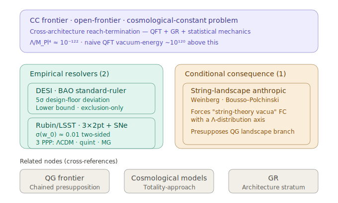

# The cosmological-constant frontier: a two-resolver walk

**Session date:** 2026-05-27
**Source:** captured through the live chat entry point at [`/explorer/ask-the-map.html`](https://causaldynamicsemergent-gif.github.io/periodic-table-of-physics/explorer/ask-the-map.html)
**Substrate version:** canonical data v95 · schema v19 · 33 read-only lookups
**Editorial register:** edited (light cleanup of conversational scaffolding; vocabulary discipline preserved; citations and deep links verbatim)
**Opening question:** *Which experimental programs target the cosmological-constant problem, and through which physical channels?*

This session walks the cosmological-constant frontier across five turns: the two-resolver landscape (DESI's BAO standard-ruler and Rubin/LSST's 3×2pt probe-sum, with the sensitivity-encoding-kind difference and the asymmetric per-program-predictions structure surfaced); the single recorded conditional-consequences branch on the frontier (string-landscape anthropic selection, with the presupposition chain through `qg-frontier`); the methodological distinction between BAO and 3×2pt as scientific probes — background vs growth, spectroscopic vs photometric, ΛCDM-tension-lineage divergence; an explorer-rendering description of the frontier with an inline structural diagram; and a cross-frontier pattern survey identifying which other open frontiers carry the same two-distinct-program structure.

---

## Turn 1 — Which experimental programs target the cosmological-constant problem?

The catalogue records two experimental programs targeting the cosmological-constant frontier, both from the precision-cosmology side rather than from a candidate-foundational derivation of Λ. The candidate-targeting lookup on `cc-frontier` is empty — no foundational program (string-landscape multiverse selection, NCG spectral-action vacuum, asymptotic-safety running) is recorded as claiming to target the frontier in the structural sense the catalogue admits; the frontier is currently engaged observationally, through the dark-energy equation-of-state (w_0, w_a).

**DESI — BAO standard-ruler distances combined with CMB priors and Type-Ia supernovae.** The Dark Energy Spectroscopic Instrument's flagship measurement is sub-percent BAO across 0.1 < z < 3.5, which when combined with Planck CMB priors and the Pantheon+/Union3/DES-SN5YR SN Ia compilations constrains (w_0, w_a) directly. The sensitivity encoded in the catalogue is a 5σ design-floor on deviation from the ΛCDM point (w_0, w_a) = (−1, 0) — a lower bound, bounds-setting rather than measurement-discriminating in the point-prediction sense, because the competing dark-energy classes do not currently supply program-internal point predictions in (w_0, w_a). The catalogue cites Adame et al. (DESI Collaboration) 2024 "DESI 2024 VI: Cosmological Constraints from the Measurements of Baryon Acoustic Oscillations" JCAP 02:021 (2025) arXiv:2404.03002, §8, reporting Year-1 BAO+CMB+SN deviation from ΛCDM of 2.6σ (Pantheon+) / 3.5σ (Union3) / 3.9σ (DES-SN5YR) under the w_0–w_a CDM parameterization, with the full 5-year dataset projected to reach ≥5σ discrimination or definitive ΛCDM consistency. Edge: [`#/edge/edge-rs-desi-cc-frontier`](https://causaldynamicsemergent-gif.github.io/periodic-table-of-physics/explorer/Map_v34_explorer.html#/edge/edge-rs-desi-cc-frontier). Program node: [`#/discourse/desi`](https://causaldynamicsemergent-gif.github.io/periodic-table-of-physics/explorer/Map_v34_explorer.html#/discourse/desi).

**Vera C. Rubin Observatory (LSST) — joint 3×2pt + photometric SNe + cluster counts.** Rubin reaches (w_0, w_a) through a different methodology: weak-lensing cosmic shear, galaxy clustering, and galaxy–galaxy lensing combined (the 3×2pt analysis), with photometric supernovae and cluster counts in joint constraint. The catalogue records σ(w_0) ≈ 0.01 and σ(w_a) ≈ 0.04 at the Y10 joint-probe design floor (two-sided precision), corresponding to DESC SRD figure-of-merit FoM ≳ 500 — roughly an order-of-magnitude tightening over DESI Year-1 σ(w_0) ≈ 0.07, σ(w_a) ≈ 0.27. Citation: The LSST Dark Energy Science Collaboration (Mandelbaum, Eifler, Hložek, et al.) 2018 "The LSST Dark Energy Science Collaboration (DESC) Science Requirements Document" arXiv:1809.01669, §5. This edge is the catalogue's second populated per-program-predictions resolves edge — three programs carry point values at the percent-level precision Rubin discriminates:

- **ΛCDM** with w_0 = −1 exactly, w_a = 0 by construction (Aghanim et al., Planck 2018 VI, A&A 641:A6 §6.3 — structural fact of the model, not a fit parameter);
- **Quintessence (thawing-vs-freezing class)** with w_0 ≈ −0.95 ± 0.05, anchored to Caldwell–Linder 2005 PRL 95:141301 and the Linder 2003 w(a) = w_0 + w_a(1−a) parametrization;
- **Modified gravity (f(R), DGP brane-world, late-time IR modification)** with background w_0 ≈ −1 ± 0.05 — but the catalogue notes the discriminator is not primarily w_0 (nearly degenerate with ΛCDM) but the growth-rate-vs-expansion-rate split via the modified-gravity-distinct growth index γ_eff (GR value γ ≈ 0.55), and the (μ_0, Σ_0) phenomenological-MG parameters tighten ~5–10× over DES Y3 (Abbott et al. 2023 PRD 107:083504 §V).

Edge: [`#/edge/edge-rs-rubin-lsst-cc-frontier`](https://causaldynamicsemergent-gif.github.io/periodic-table-of-physics/explorer/Map_v34_explorer.html#/edge/edge-rs-rubin-lsst-cc-frontier). Program node: [`#/discourse/rubin-lsst`](https://causaldynamicsemergent-gif.github.io/periodic-table-of-physics/explorer/Map_v34_explorer.html#/discourse/rubin-lsst).

The two programs are complementary along the methodology axis: DESI reaches the equation-of-state through the sound-horizon-at-drag-epoch standard ruler; Rubin reaches it through weak-lensing growth and luminosity-distance probes. They are also encoded differently in the catalogue — DESI as a 5σ discovery floor on departure from the cosmological-constant point, Rubin as a two-sided percent-level precision on (w_0, w_a) with point-predictive competitors. The frontier itself, with both resolvers listed and the GR/QFT/stat-mech reach-termination structure: [`#/discourse/cc-frontier`](https://causaldynamicsemergent-gif.github.io/periodic-table-of-physics/explorer/Map_v34_explorer.html#/discourse/cc-frontier).

---

## Turn 2 — What structural consequences would a confirmed (w_0, w_a) ≠ (−1, 0) force?

The catalogue records exactly one conditional-consequences entry on `cc-frontier`, and reading it carefully clarifies what the experimental programs from the previous answer can and cannot adjudicate.

**The one recorded branch: anthropic selection across the string landscape.** The condition is stated as: if the cosmological constant value Λ ≈ 10^{−122} (Planck units) is set anthropically by selection across the string-theory landscape, with condition-citations to Weinberg 1989 "The cosmological constant problem" Rev Mod Phys 61:1 (the problem statement), Weinberg 1987 "Anthropic bound on the cosmological constant" Phys Rev Lett 59:2607 (the anthropic-bound derivation), Susskind 2003 "The anthropic landscape of string theory" arXiv:hep-th/0302219, and Bousso–Polchinski 2000 "Quantization of four-form fluxes and dynamical neutralization of the cosmological constant" JHEP 06:006.

**What this would force, structurally.** A new formal classification — the "string-theory vacua" classification, already conditionally implied by the string-landscape resolution of `qg-frontier` and organized there along axes (compactification-manifold × flux-content × moduli-stabilization-pattern) — would be forced to carry an additional load-bearing axis: a Λ-distribution axis, because anthropic selection across the landscape is the mechanism that selects the observed Λ value. The Λ-axis is not an arbitrary binning: it discretizes the four-form-flux quantization per Bousso–Polchinski 2000 §3, and the observed value Λ/M_Pl⁴ ≈ 10^{−122} (Weinberg 1989; PDG 2024) is the cell selected by structure-formation constraints per Weinberg 1987. The quantitative scale recorded on this implication is log₁₀(Λ/M_Pl⁴) ≈ −122, two-sided central value.

**The chained presupposition.** The cosmological-constant anthropic resolution does not stand alone — it presupposes that `qg-frontier` resolves through the string-landscape branch. On `qg-frontier` itself, the catalogue records that branch with its own conditional: if string theory's UV-complete formulation of QG is the resolution, with the consistent vacua forming a discrete landscape, citing Polchinski 1998 "String Theory" Vols I–II, Susskind 2003, Douglas 2003 "The statistics of string / M theory vacua" JHEP 05:046, and Bousso–Polchinski 2000. The forced "string-theory vacua" classification at that level carries a vacuum-count scale of log₁₀(N_vacua) ≳ 500 — a lower bound, with the Douglas / Bousso–Polchinski estimate of ~10⁵⁰⁰ flux-stabilized vacua admitted to grow as additional vacuum families are catalogued. The Λ-distribution axis the `cc-frontier` branch demands is then a refinement of a classification already conditionally created by the QG branch. Frontier with both branches visible: [`#/discourse/qg-frontier`](https://causaldynamicsemergent-gif.github.io/periodic-table-of-physics/explorer/Map_v34_explorer.html#/discourse/qg-frontier). The CC frontier itself: [`#/discourse/cc-frontier`](https://causaldynamicsemergent-gif.github.io/periodic-table-of-physics/explorer/Map_v34_explorer.html#/discourse/cc-frontier).

**What the catalogue does not record, and what that means for DESI/Rubin.** Only the anthropic-landscape branch is articulated as a conditional consequence. There is no recorded conditional-consequences entry for:

- a confirmed dynamical-dark-energy resolution (quintessence with a derived potential — what would be forced on the field-content classifications);
- a modified-gravity resolution (what the growth-index γ_eff deviation would force on the architecture stratum);
- a relaxation-mechanism resolution (Abbott-type, Kaloper–Padilla sequestering, vacuum-decay flavors).

This is an important reading-direction for the DESI and Rubin results discussed previously. The anthropic-landscape branch is structurally most consonant with observing w_0 = −1, w_a = 0 exactly — the cosmological-constant point. A DESI / Rubin Y10 confirmation of evolving dark energy at the ≥5σ / percent-precision level would empirically disfavor the only conditional resolution the catalogue currently articulates, without populating an alternative conditional carrier. The catalogue records what the literature has structurally articulated; the absence of conditional consequences for the dynamical-DE and modified-gravity branches reflects that those programs are currently hypothesis classes with parameter freedom rather than UV-complete theories with derived structural commitments — the same curatorial fact that left the DESI edge's per-program predictions empty and marked bounds-setting. The Weinberg–Susskind–Bousso–Polchinski branch is, at present, the only branch with enough theoretical articulation for the catalogue to admit its structural consequences.

---

## Turn 3 — What makes the Rubin 3×2pt analysis distinct from the DESI BAO approach?

The distinction runs deeper than "two probe combinations measuring the same equation-of-state." The catalogue's encoding flags it — DESI's sensitivity is sigma_deviation, 5σ, lower bound (a discovery floor); Rubin's is dimensionless, 0.01, two-sided (a precision measurement with three populated competing predictions). The catalogue's own note records that this is the project's first instance of two parallel resolves edges targeting the same frontier with different sensitivity-encoding kinds, and that is the formal echo of a real methodological gap.

**Standard ruler vs. probe-sum.** DESI is a single-observable measurement: the BAO sound horizon r_d ≈ 147.09 ± 0.26 Mpc (Planck 2018 + DESI, recorded at `cell-cosm-BAO-sound-horizon-DESI`) imprinted in the galaxy two-point function at the angular scale θ_BAO(z) and Hubble-radial scale Δz_BAO(z). Modulo the r_d calibration that comes from pre-recombination CMB physics (Ω_b h², Ω_m h² fixing the sound speed and recombination time), the measurement returns D_M(z)/r_d (transverse) and r_d · H(z) (radial) across 0.1 < z < 3.5. That is pure expansion history — geometry only. Rubin's 3×2pt is a sum of three correlation functions: cosmic-shear auto-correlation ⟨γγ⟩ (lensing distortion of background sources by intervening LSS), galaxy-position auto-correlation ⟨δ_g δ_g⟩ (clustering of foreground tracers), and the cross-correlation ⟨δ_g γ⟩ (galaxy–galaxy lensing). The three together constrain the lensing kernel (distances) and the growth of structure (σ_8(z) and the matter power-spectrum shape) simultaneously. SN Ia luminosity distances and cluster counts enter as additional probe-stacks.

**Background vs. growth — and why this matters for modified gravity.** DESI is a background-only probe in the most direct sense: any modified-gravity theory that exactly reproduces H(z) and D_A(z) is invisible to it, even in principle. This is the structural reason the Rubin edge's per-program-predictions entry for f(R) gravity, DGP brane-world, and late-time IR modification records w_0 ≈ −1 ± 0.05 — these classes mimic ΛCDM expansion at the percent level. The discriminator is the growth-rate / expansion-rate split: modified gravity predicts a distinct growth index γ_eff = d ln δ_m / d ln a deviating from the GR value γ ≈ 0.55 (Sotiriou–Faraoni 2010 Rev. Mod. Phys. 82:451 §IV.C), and the phenomenological-MG parameters (μ_0, Σ_0) — measured to (μ_0 = 0.04 ± 0.32, Σ_0 = 0.05 ± 0.08) by DES Y3 (Abbott et al. 2023 PRD 107:083504 §V) — tighten by a forecast factor of ~5–10× under Rubin Y10. Rubin can in principle distinguish a Horndeski-class theory that exactly reproduces DESI's BAO from ΛCDM; DESI alone cannot. Conversely, DESI's spectroscopic precision on H(z) at z > 1 is something Rubin's photometric SNe and lensing kernels cannot match — the high-z geometric leverage on w_a lives in DESI's lane.

**Spectroscopic vs. photometric, with its systematics signature.** DESI delivers σ_z ≲ 0.001 for ~40 million galaxies and quasars — the spectroscopic precision is what makes a sub-percent BAO-peak fit possible at all. Rubin is photometric: ~20 billion galaxies across ugrizy bands at σ_z/(1+z) ~ 0.02–0.05, with photo-z uncertainty as the leading systematic for the lensing kernel. The 3×2pt systematics budget — intrinsic galaxy alignments, baryonic feedback on the small-scale matter power, multiplicative shear-measurement bias, photo-z tail mismodeling — is qualitatively different from BAO systematics (galaxy bias modeling, reconstruction-pipeline shifts, fiber-collision corrections), which is why the two are usually combined rather than averaged. The probes are correlated through shared late-time LSS but their systematic floors are not.

**Linear vs. weakly-nonlinear scales.** The BAO feature sits at ~150 Mpc, comfortably linear; nonlinear damping shifts the peak by ~1% in known ways and is removed by reconstruction. Rubin's 3×2pt extends into mildly nonlinear scales (~ few Mpc and below for small-scale clustering and shear), where baryonic-feedback modeling and emulator-based matter-power-spectrum predictions enter — a different theoretical-systematics layer.

**Different ΛCDM-tension lineages.** This is the point worth surfacing most strongly because it is buried in the catalogue's cell structure rather than the resolves-edge structure. The DESI cell `cell-cosm-BAO-sound-horizon-DESI` carries the evolving dark-energy anomaly (3.5σ median across SN samples) — that is DESI's lane on `cc-frontier`. Rubin's 3×2pt simultaneously inherits the S_8 / weak-lensing-vs-CMB tension lineage, recorded at `cell-cosm-sigma8-weak-lensing` — KiDS-1000 S_8 = 0.766⁺⁰·⁰²⁰₋₀.₀₁₄ (Asgari et al. 2021), DES Y3 S_8 = 0.776 ± 0.017 (Abbott et al. 2022), HSC Y3 S_8 = 0.776 ± 0.020 (Dalal et al. 2023), all ~2–3σ below the Planck-CMB-inferred 0.832 ± 0.013. Rubin Y10 3×2pt is the precision successor to DES Y3 3×2pt; whichever way that tension resolves — systematics, baryonic-feedback mismodeling, or new physics in growth — Rubin will adjudicate it on the same probe combination that produced it. DESI carries no native handle on σ_8 / S_8 (BAO is background); Rubin carries both lanes.

**Calibration anchors.** DESI's geometric measurements are absolute-distance only through the CMB-anchored r_d; without that prior, BAO measures (D_M/r_d, r_d·H) which is dimensionless up to a length scale. Rubin's SN Ia lane couples to the Cepheid/TRGB distance ladder (and through it to the Hubble-tension cluster), the lensing lane requires shear-calibration via image-simulation pipelines (multiplicative shear bias m, additive c), and the photo-z lane requires spectroscopic training samples — for which DESI's overlap is itself an input. The two programs are operationally coupled even before any cosmological joint fit.

**Why both, then.** The catalogue's full cosmological-observations classification ([`#/fc/cosmological-observations`](https://causaldynamicsemergent-gif.github.io/periodic-table-of-physics/explorer/Map_v34_explorer.html#/fc/cosmological-observations)) makes the point visible: ΛCDM is being tested at the few-percent level by multiple probes, several of which sit at 3–5σ tension, and the resolutions partition into pre-recombination physics (early dark energy, extra N_eff), late-time physics (dynamical DE, modified gravity), or systematics. A scenario where DESI's evolving-DE hint resolves to w_0 ≠ −1 while Rubin's σ_8 tension persists and the growth-vs-expansion split (μ_0, Σ_0) shows a coherent shift is physically very different from a scenario where DESI's anomaly evaporates by Year-5 while Rubin tightens (μ_0, Σ_0) consistent with GR — and only the joint measurement distinguishes them. Edge pages: DESI's resolves edge [`#/edge/edge-rs-desi-cc-frontier`](https://causaldynamicsemergent-gif.github.io/periodic-table-of-physics/explorer/Map_v34_explorer.html#/edge/edge-rs-desi-cc-frontier), Rubin's [`#/edge/edge-rs-rubin-lsst-cc-frontier`](https://causaldynamicsemergent-gif.github.io/periodic-table-of-physics/explorer/Map_v34_explorer.html#/edge/edge-rs-rubin-lsst-cc-frontier), and the CC frontier they target [`#/discourse/cc-frontier`](https://causaldynamicsemergent-gif.github.io/periodic-table-of-physics/explorer/Map_v34_explorer.html#/discourse/cc-frontier).

---

## Turn 4 — What does the explorer view look like for the cosmological-constant frontier?

The explorer is a JavaScript-rendered single-page app whose hash-routed views don't materialize through a static fetch, so what follows is a description of what the live page structurally renders, followed by the same content sketched as an inline diagram so the structural picture is in hand before clicking through.

**What the explorer page renders.** Navigating to `#/discourse/cc-frontier` on the explorer brings up the open-frontier node's full record. The page organizes the same fields the lookups return, in panels: a header with the node id, type, and full descriptive name; the prose description of the frontier (the cross-architecture reach-termination involving QFT, GR, and statistical mechanics jointly, with the Λ ≈ 10^{−122} value statement and the ~10^{120} naive-QFT vacuum-energy estimate); a resolvers panel listing the two experimental-program edges (DESI, Rubin) with their sensitivity encodings, timeline, and the per-program-predictions block where it's populated; a conditional-consequences panel showing the string-landscape anthropic branch with its condition statement, condition-citations, and the forced new-classification structure with the Λ-distribution axis; cross-references to related nodes (`qg-frontier`, `cosmological-models`, `gr`, the `cosmological-observations` classification); and a citations block. The full citation text — long descriptive entries like the Adame et al. 2024 DESI Year-1 result string and the Caldwell–Linder 2005 thawing/freezing-class definition — is rendered as the catalogue records it, with arXiv identifiers and journal references intact. The deep links embedded in prose throughout this transcript are the same hash routes the explorer's internal navigation uses, so clicking through any of them lands in the corresponding panel.

**The structural content as a single diagram.** Here is the same record organized as an inline structural picture — the frontier in the centre, the empirical-resolution lane (DESI + Rubin) on one side, and the theoretical-resolution branch with its presupposition-chain through `qg-frontier` on the other:

A few notes on how that structural summary maps to the live explorer page itself, since the diagram compresses what the page renders in full:

The header card on the explorer carries the full prose description rather than a one-liner — the cross-architecture reach-termination is laid out with the ~10¹²⁰ naive-QFT discrepancy explained, the historical SUSY-cancellation status noted, and the candidate-resolution branches discussed in prose before being broken out as structured conditional-consequences entries. The two resolver tiles each expand to the full citation strings pulled in the earlier turn — the Adame et al. 2024 DESI Year-1 result string with the 2.6σ / 3.5σ / 3.9σ breakdown by SN sample, the Mandelbaum et al. 2018 DESC SRD passage with FoM ≳ 500 and σ(w_0) ≈ 0.01, σ(w_a) ≈ 0.04 — and Rubin's tile carries the three populated competing predictions as a nested table with their own per-program citation strings. The conditional-consequence tile expands the implication into its derivation-citation chain (Douglas 2003, Denef–Douglas 2004, KKLT 2003 on the QG-frontier-side host classification; Weinberg 1987, Susskind 2003, Bousso–Polchinski 2000 on the cc-frontier-side Λ-distribution axis).

The "related nodes" row across the bottom of the diagram corresponds to the cross-reference panel on the explorer page, which also includes the bears-on edges from the architecture and totality-approach side (where `gr` and `cosmological-models` carry the loose-ends articulating the frontier from their own strata). Clicking through any of the gray cells in the diagram is equivalent to clicking the corresponding panel link in the explorer.

Two things the diagram intentionally omits because they're scale rather than structure: the full quantitative-scale records attached to each entity (the BAO sound-horizon length 147.09 ± 0.26 Mpc, the dimensionless 0.01 precision, the log₁₀(Λ/M_Pl⁴) = −122 anchor, the log₁₀(N_vacua) ≳ 500 chain anchor on the QG side), and the timelines (DESI: running, Rubin: running). Those live in the panel detail on the page itself, accessible at [`#/discourse/cc-frontier`](https://causaldynamicsemergent-gif.github.io/periodic-table-of-physics/explorer/Map_v34_explorer.html#/discourse/cc-frontier).

---

## Turn 5 — Are there other open frontiers in the catalogue with this same two-resolver structure?

Walking the full list of open-frontier nodes through the resolvers lookup gives a sparse landscape. The catalogue records 11 open frontiers; the resolver-edge distribution across them is:

| Frontier | Resolver edges | Programs involved |
| --- | --- | --- |
| `strong-cp-problem` | 2 | Axion-haloscope network, next-gen EDM searches |
| `cc-frontier` | 2 | DESI, Rubin/LSST |
| `hierarchy-problem` | 3 | FCC (three edges from one program) |
| `matter-antimatter-asymmetry` | 1 | Next-gen EDM searches |
| `qg-frontier`, `bh-info-paradox`, `flavor-puzzle`, `measurement-problem`, `dark-matter`, `ns-regularity`, `topological-phases-classification` | 0 | — |

The same structural pattern — two resolves edges from two distinct experimental programs — appears exactly once elsewhere: `strong-cp-problem`. And the catalogue's own internal commentary on the EDM-program / strong-CP-problem edge flags this explicitly — it records that this edge is the first instance of a single frontier carrying two resolves edges from independent experimental programs, with `cc-frontier` then following as the second. The strong-CP-problem pair has the same two-channel-complementarity logic the `cc-frontier` pair has: one program targets the new particle the proposed mechanism introduces (axion haloscopes, measuring g_aγγ ≲ 10⁻¹⁵ GeV⁻¹), and the other bounds the order parameter the mechanism is meant to relax (next-gen EDM searches, targeting |d_n| ≲ 10⁻²⁷ e·cm and hence |θ̄_QCD| via the Crewther–DiVecchia–Veneziano–Witten relation). Edges: [haloscope edge](https://causaldynamicsemergent-gif.github.io/periodic-table-of-physics/explorer/Map_v34_explorer.html#/edge/edge-rs-axion-haloscope-network-strong-cp-problem), [EDM edge](https://causaldynamicsemergent-gif.github.io/periodic-table-of-physics/explorer/Map_v34_explorer.html#/edge/edge-rs-edm-program-strong-cp-problem).

Two important sub-pattern distinctions worth surfacing before that mapping is treated as one-to-one:

**The per-program-predictions status differs between the two cases.** Both strong-CP-problem edges are bounds-setting with no populated competing predictions — the candidate-foundational programs (Peccei–Quinn / KSVZ / DFSZ axion-class, anthropic θ̄ selection, Vafa–Witten structural argument) parameterize relations between f_a, m_a, g_aγγ and the residual θ̄ rather than supplying single discriminating point predictions admissible under the firewall. The strong-CP-problem pair therefore probes a shared Peccei–Quinn resolution from two complementary directions without point-prediction discrimination between competing programs. By contrast, the `cc-frontier` pair is asymmetric: DESI is bounds-setting (no per-program point predictions in (w_0, w_a) admitted from the evolving-DE classes), while Rubin's edge carries three populated competing-prediction entries — ΛCDM (w_0 = −1 exactly), quintessence (w_0 ≈ −0.95 ± 0.05 thawing/freezing class), and modified gravity (background w_0 ≈ −1 ± 0.05 with the discriminator on growth-index γ_eff). The catalogue records Rubin's edge as the project's first measurement-discriminating per-program-predictions-populated resolves edge on a cosmological frontier, and the parallel pair with DESI as the first instance of two resolves edges with different sensitivity-encoding kinds (sigma_deviation vs dimensionless).

**The hierarchy-problem case is structurally different from both.** Three edges, all from FCC, each targeting a different observable: λ_HHH (Higgs trilinear via di-Higgs at FCC-hh, with competing predictions populated for SM and composite-Higgs), direct BSM production reach (~30 TeV in associated production, bounds-setting), and m_W precision (σ(m_W) ≈ 0.5 MeV via threshold scan at FCC-ee, with competing predictions for the SM electroweak global-fit value 80.3536 ± 0.0061 GeV). That's a single-program multi-channel structure rather than a multi-program structure: [`hierarchy-problem`](https://causaldynamicsemergent-gif.github.io/periodic-table-of-physics/explorer/Map_v34_explorer.html#/discourse/hierarchy-problem), with FCC covering the candidate-foundational-program space (SUSY at TeV, composite Higgs, extra dimensions, anthropic, cosmological relaxation) through three structurally distinct probes that no single one of which could deliver alone. It's a third structural pattern: a single program with a multi-channel deliverable spread across a frontier whose theoretical program space is too broad for any single observable to discriminate.

**The seven empty frontiers.** Six are empirically orphaned for different structural reasons: `qg-frontier` and `bh-info-paradox` because their candidate resolutions (string-landscape, AdS/CFT, LQG; firewall, ER=EPR, soft-hair complementarity) are theoretical programs with no near-term experimental discriminator at scales accessible to laboratory or astrophysical probe; `flavor-puzzle` because the Yukawa-hierarchy explanation lives in deep-UV physics with no current experimental program targeting the origin (as distinct from precision measurement of CKM/PMNS elements, which are cells in their own classifications rather than frontier targets); `measurement-problem` because it is an interpretive frontier with no quantitative discriminator that current experiment can run; `ns-regularity` because it is a Clay-mathematical frontier; `topological-phases-classification` because it is a structural-mathematical frontier whose experimental discharge happens cell-by-cell in condensed-matter realizations rather than frontier-level. The `dark-matter` frontier is the exception in this list — it is empirically active but its candidate-space is wide enough (WIMPs, axions, sterile neutrinos, PBHs, fuzzy DM, SIMPs, FIMPs) that the experimental programs target candidate-specific cells within the dark-matter-candidates classification rather than the frontier itself. The catalogue's editorial choice there is to keep resolves edges at the cell level where the candidate-specific point predictions can be admitted, and leave the frontier-level resolver count at zero.

So the headline answer is one other frontier (`strong-cp-problem`) with the same two-distinct-program structure, the `hierarchy-problem` as a third pattern with three edges from a single program, and the rest of the open-frontier landscape carrying single-program or empty coverage.

---

*End of session. Captured 2026-05-27 through the live chat entry point at [`/explorer/ask-the-map.html`](https://causaldynamicsemergent-gif.github.io/periodic-table-of-physics/explorer/ask-the-map.html). Editorial pass: light conversational scaffolding trimmed (closing follow-up offers removed from each turn); deep-link shorthand expanded to full Markdown URLs into the seventeen-file E5 explorer build; the recovered structural diagram embedded in turn 4; all citations preserved verbatim; physics preserved entirely. Substrate verified against canonical v95 via the live MCP server at session time. Companion files: [`cc-frontier-diagram.svg`](./cc-frontier-diagram.svg) (the structural-view diagram embedded in turn 4); [`README.md`](./README.md) (the SESSIONS directory index).*
